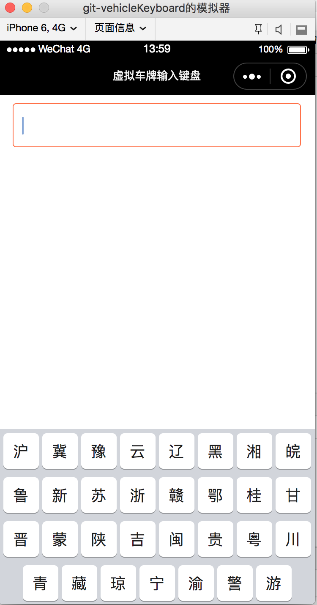
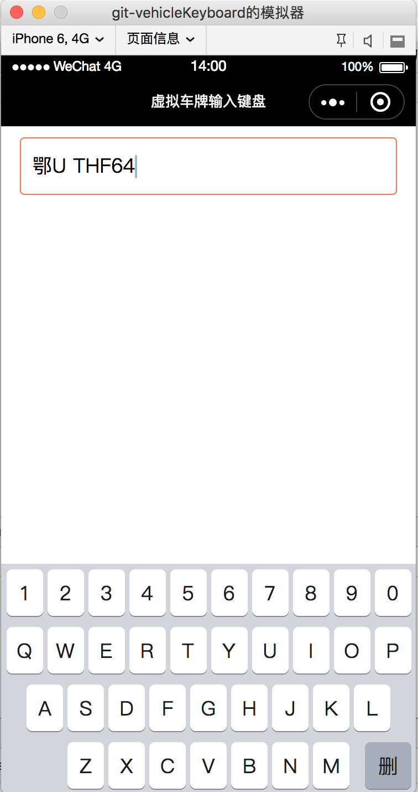

# vehicleKeyboard
微信小程序-虚拟车牌输入键盘组件
--------------------------
## 需求
微信小程序调用系统键盘的时候能够自定义的只有右下角一个功能按键的文字信息，但是项目中有时候需要更大自由度的自定义键盘，
以车牌输入为例，为了更好的用户体验，可以把车牌的地区信息直接展示给用户选择，更加便捷，在这个需求基础上开发了这个虚拟车牌输入键盘。
## 效果

<div align="center">
  
  
</div>

## 功能
1. 键盘初始化
    1. 加载一次车牌地区信息，如果加载成功则将结果存入缓存中，本次小程序生命周期中调用车牌键盘时将不再请求数据而是使用缓存中的数据，如果第一次加载失败则使用键盘默认配置的车牌地区信息，另外如果需要手动更新车牌地区信息也可手动调用更新方法：`update(url)`
2. 键盘键入
    1. **车牌号组成规则**：第一位为地区或其他特殊信息，第二位为字母，之后的五位是字母和数字混合；
    2. **键入**：调出键盘以后第一个界面是地区选择，当选择完地区以后键盘自动切换到第二个界面，第二个界面是字母选择，此时还不能选择数字，所以数字键盘是灰色不可点击的，当输入到第三个信息时，键盘上的字母和数字都处于可点击选择状态，最多可键入7个字符;
    3. **删除**：点击删除按钮时相当于键入过程的回退，删除到只剩一个字符时数字键盘回退到灰色不可选择状态，全部删除时键盘回退到选择地区界面；
3. 键盘事件
    1. 输入（包括点击删除按钮）过程中会触发键盘组件的`input`事件，同时会回传当前已输入值，可捕获此事件获取键盘输入值；
    2. 点击右下角的‘完成’按钮会触发键盘组件的`done`事件，同时会回传当前已输入值，可捕获此事件然后自定义处理逻辑；
## 使用
1. 父页面配置
    1. json文件引入此组件
    ```javascript
    {
        "usingComponents": {
            "vehicleKeyboard": "/components/vehicleKeyboard/vehicleKeyboard"
         }
    }
    ```
    2. wxml文件插入此组件
    ```html
    <!-- 车牌键盘组件开始 -->
    <vehicleKeyboard bindinput="inputChange" binddone="inputDone" id="keyboard"></vehicleKeyboard>
    <!-- 车牌键盘组件结束 -->
    ```
    3. js文件处理键盘事件<br />
    包括父页面的`onReady`事件中进行键盘组件的地区信息更新`update`事件，父页面的虚拟输入框元素的点击时触发`showKeyboard`，父页面其他部分点击时触发`hideKeyboard`，虚拟键盘组件输入时的`inputChange`事件以及点击完成时的`inputDone`事件，具体使用可参考代码示例中**index.js**

## TODO
- [ ] 组件如何自动初始化